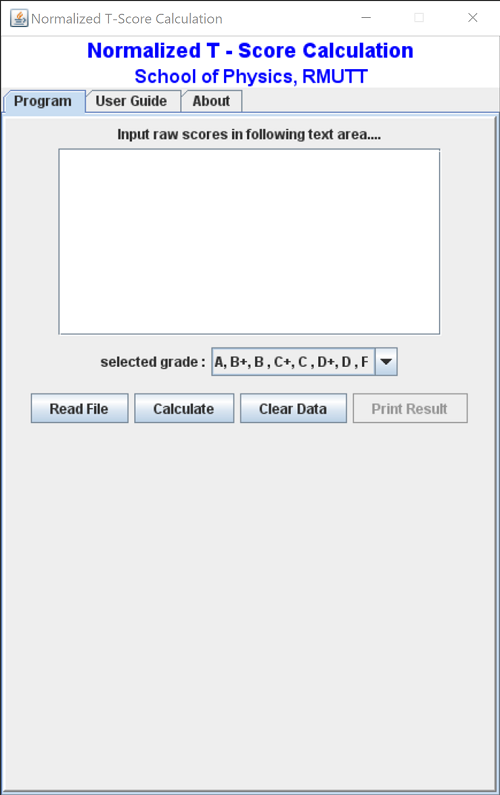

# TScore_JavaSWing
Normalized T score Calculation  with Java SWING programming.

This is an original version of Normalized T score calculation. It have been used in my school of Physics since 2009.
In 3 or 4 years later, Java security blocked this app and  working via internet network was not allowed. So I transform this app to
JavaScript language as you see in this <a href="http://www.rmutphysics.com/TScore/TScoreHtml/TScoreHtml.html"> link.</a>
### But it still works well on desktop. Try it.

